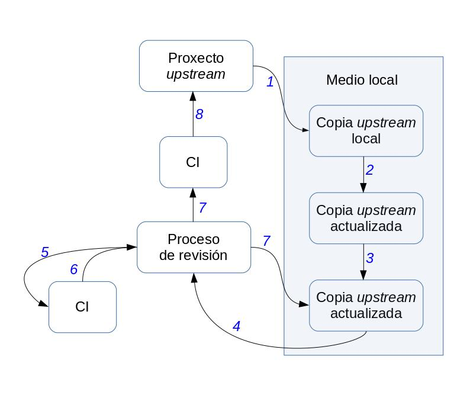
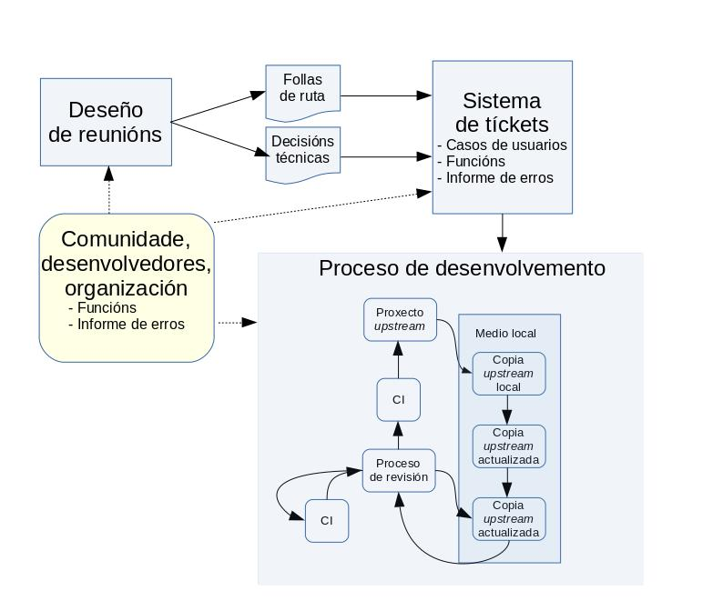
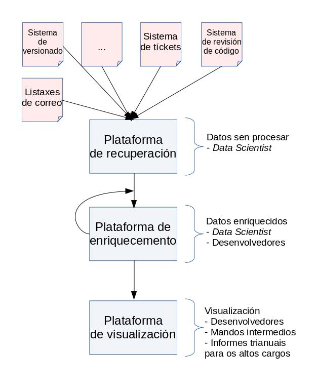

# Introdución

A infraestrutura é un dos puntos chave de InnerSource. Proporciona as ferramentas necesarias para o desenvolvemento e a comunicación entre os equipos de desenvolvemento.

Desenvolvedores, mandos intermedios e directivos forman parte do mesmo proceso de cambio de mentalidade que require pasar a formar parte dun proceso de desenvolvemento de software máis aberto. E todos han de ser capaces de aceptar as novas regras do xogo. 

Posto que InnerSource aporta novos principios de desenvolvemento nas comunidades de código aberto, as comunidades InnerSource precisan dun cambio cultural no que a comunicación aberta e a transparencia no proceso da toma de decisións sexan vitais. 

Así pois, a infraestrutura seleccionada debe ser aberta e transparente; debe facilitar aos desenvolvedores o seguimento dalgunhas pautas específicas como no caso dos procesos de revisión de código. Isto tamén debería axudar a evitar imprevistos. Todo colaborador dunha nova infraestrutura debe seguir as mesmas regras. Haberá diferenzas no nivel de acceso permitido, por exemplo, entre os novos desenvolvedores e os que xa están a presentar *commits*.

Ademáis, esta infraestrutura debe ser sinxela seguindo o enfoque KISS (polas súas siglas en inglés, *Keep It Short and Simple*, facer algo curto e doado). Isto debería contribuír a diminuír a barreira de acceso aos novos contribuidores. Canto máis fácil sexa o proceso, máis atractivo resultará para quen queira facer a súa primeira contribución a algunha das fontes de datos. 

Nas comunidades OSS ocorre o mesmo; xeralmente precisan dunha suscripción para algunhas das ferramentas, como pode ser as listaxes de correo ou as wikis. Unha vez que se ten, o colaborador xa pode actualizar as wikis e enviar correos electrónicos. No caso do código fonte, o proceso foise burocratizando a medida que a revisión do código foi cobrando importancia. 

Por outro lado, as webs como [GitHub](https://github.com/) e [GitLab](https://gitlab.com/) proporcionan acceso ao código fonte, ás incidencias, ás *pull requests* e á edición das wikis mediante unha única conta. As comunidades que empregan esta infraestrutura adoitan contar cun modelo de gobernación no que, ademais, o *trusted committer* debe revisar calquera tipo de cambio.

En InnerSource existen aspectos chave que se deben ter en conta vencellados principalmente aos atributos de apertura e transparencia, mais tamén deben ser arquivables, localizables e sinxelos no uso e na minería de datos. 

- **Apertura**: Todas as ferramentas empregadas no proceso de desenvolvemento de software deben ser accesibles para calquera persoa da organización. Isto permite xerar confianza entre os desenvolvedores e reduce as barreiras para calquera que queira contribuír nos proxectos InnerSource. Deste xeito, tódalas contribucións son benvidas e estas poden vir de calquera tipo de contribuidor. 
- **Transparencia**: Céntrase na autoría de distintas contribucións. Desde o mesmo proceso de envío do código, ata a corrección de erratas, todo debe quedar rexistrado, mesmo a autoría de cada contribución ou cambio realizado. 

Isto servirá para entender quen son os principais contribuidores dentro da comunidade. Os cales pasarán a conformar o equipo principal das devanditas comunidades. Como non tódalas contribucións son ao código, a autoría debería axudar a comprender outro tipo de contribucións; como a documentación, as mentorías ou prestar axuda nos foros a outros membros. Todas estas son actividades de interese nas comunidades InnerSource. 

- **Arquivable:** As ferramentas deben xerar un arquivo do rexistro das accións previas. Isto será de grande axuda en relación a pezas concretas de código, solucionar debates técnicos previos das canles de comunicación ou na toma de decisións dos cumes de deseño; así como á hora de facer referencias. 
- **Localizable:** A medida que máis proxectos se suman ó proceso InnerSource, a cantidade de repositorios de información crecerá de igual xeito. É importante dispor de capacidades de busca dentro da plataforma. Isto axudaría a reutilizar e descubrir proxectos e contribuidores útiles para os seus propios fins. Tamén será de axuda saber se existen outros proxectos que cubran as necesidades específicas. 
- **Recuperación de datos doada:** O *toolchain* seleccionado debería ser sinxelo de minar. Podería tratarse dunha ferramenta externa que mine calquera fonte de datos dispoñible e constrúa áreas específicas do proceso de desenvolvemento de software ou podería proporcionalo a propia estrutura. Isto sería útil para que a comunidade entendese onde se atopan os puntos de conxestión no proceso, pero tamén axudará a detectar posibles problemas, bloqueos ou calquera outra situación non desexada. 

Tal e como se explica no capítulo dedicado ás métricas, os datos desempeñan un papel fundamental na aplicación da metodoloxía InnerSource. Permiten comprender cara onde se dirixe todo o proceso; así como tomar decisións cando sexa necesario co obxectivo de seguir na dirección correcta. Para isto, serán tamén de importancia as ferramentas que permiten recuperar información a través dunha API (como GitHub API) ou grazas a un sistema de *log* (como a liña de comandos «git log»).

- **Dereitos de acceso:** Ao existir un proceso aberto e transparente para tomar decisións que fomentan a participación, merece a pena empregar unha infraestrutura que limite o acceso a determinados roles dentro da organización. Calquera está convidado a participar, pero o subconxunto de contribuidores terá dereito a enviar os fragmentos de código fonte ou editar as wikis da documentación. A infraestrutura debe permitir esta división de roles. Deste xeito, calquera persoa poderá ler a documentación, pero só algunhas persoas terán permiso para escribir. 

É probable que estes aspectos resulten familiares, posto que son chave á hora de poñer en marcha unha infraestrutura en proxectos de código aberto. Dous importantes libros falan deste tema. [*Producing Open Source Software*](https://producingoss.com/) [Produción de software en código aberto] de Karl Fogel e [*The Art of Community*](https://www.jonobacon.com/books/artofcommunity/) [O arte da comunidade] de Jono Bacon. O primeiro se centra nas necesidades básicas dunha infraestrutura de proxectos de código aberto establecida desde cero. Mentres que o segundo pon o foco en como dar sorporte específico con ferramentas aos fluxos de traballo. Ambos proporcionan unha excelente perspectiva sobre os proxectos de código aberto que é tamén parcialmente aplicable en proxectos InnerSource.

Tal e como declara Jono no seu libro: «_para elixir as ferramentas axeitadas, primeiro temos que saber que queremos conseguir. Temos que saber cal é o noso **fluxo de traballo**.»._ 

A seguinte sección céntrase nas necesidades da infraestrutura ao iniciar un proxecto InnerSource. Non existen grandes diferencias desde o punto de vista dos aspectos chave. Así a todo, temos que lidar coa infraestrutura existente, interna e, en moitos casos, de acceso restrinxido, e comprobar se a devandita infraestrutura é suficiente para os nosos propósitos e obxectivos ao levar a cabo a metodoloxía InnerSource. 

Polo tanto, haberá dúas áreas principais a considerar; en primeiro lugar, se é posible reutilizar a infraestrutura existente e, en segundo lugar, que ferramentas están dispoñibles que se axusten aos nosos requisitos chave no caso de necesitar unha nova infraestrutura. 

## Infraestrutura básica

Posto que InnerSource consiste principalmente nun cambio cultural, necesitamos ferramentas de fácil acceso ou baixa barreira de entrada. Canto máis sinxelas sexan de empregar, maior será o número de desenvolvedores  interesados en traballar noutras áreas da empresa e proxectos InnerSource. 

Aínda que existe un proceso de revisión de código e leva tempo aprender a facelo, tamén hai outras áreas nas que os desenvolvedores poden contribuír. Na documentación, na mera corrección de erratas da wiki colaborativa e ata nas reunións de deseño; ou incluso en actividades de revisión en proxectos da interese do colaborador ou mediante a petición de novas funcionalidades. Posto que hai diferentes xeitos de colaborar na empresa, o obxectivo de InnerSource é fomentar este tipo de accións o máximo posible, para facer saber aos desenvolvedores que as súas accións son valoradas.  

Así pois, a infraestrutura estará dividida en tres áreas principais: 

- En primeiro lugar, na infraestrutura do proceso de desenvolvemento que contén as ferramentas básicas para os desenvolvedores. Seleccionar as ferramentas axeitadas servirá para contar cun proceso claro que aporte confianza á comunidade. Calquera desenvolvedor debe seguir ese proceso co fin de evitar problemas imprevistos. Por exemplo, calquera desenvolvedor, incluso os *core committers* ou os *trusted committers*, deben afrontar un proceso de revisión cando se envía un fragmento de código. Está claro que os *trusted committers* teñen a reputación da comunidade e isto será útil no proceso de revisión, pero aínda así terán que pasar por este proceso. Un fluxo de traballo claro aporta confianza en todas as áreas empresariais. Por iso mesmo, a seguridade na definición de requisitos resultará de grande axuda no proceso de desenvolvemento do software, no uso de sistemas de versionado ou de tíckets*,* no proceso de revisión do código e na integración continua. 
- En segundo lugar, un uso sólido da infraestrutura das canles de comunicación. Estas ferramentas deben ser as máis transparentes posibles e tódalas reunións técnicas deben ir seguidas dun resumo que inclúa os resultados e decisións na listaxe de correo. Isto axuda a abrir debates técnicos, pero tamén a recompilar as decisións que foron tomadas anteriormente. Como este escenario está tomando de exemplo a grandes empresas, tamén é necesario o uso de canles de comunicacións asíncronas como o IRC moi habitual nas comunidades de código aberto. Algunhas opcións máis avanzadas poderían ser o uso de [Slack](https://slack.com/intl/es-es/), ou mesmo de [Mattermost](https://mattermost.com/), no caso de que a empresa prefira empregar código aberto interno e a aplicación de SaaS (polas súas siglas en inglés, Software como servizo). 
- En terceiro lugar, a infraestrutura da monitorización é chave á hora de aplicar InnerSource e, en xeral, de achegar unha nova metodoloxía ás empresas. Esta é unha das principais diferenzas entre as comunidades de código aberto; abertas por defecto e que seguen os aspectos chave mencionados. Con todo, a infraestrutura empregada para medir os avances nos procesos non foi un dos obxectivos primordiais das comunidades de código aberto que, en xeral, empregan unha metodoloxía de desenvolvemento exitosa, cada unha coas súas propias peculiaridades, pero aberta por defecto. InnerSource necesita este tipo de infraestrutura, posto que os desenvolvedores e os seus superiores precisan da retroalimentación para o seu rendemento. Tanto o cambio no proceso de desenvolvemento de software nas grandes organizacións, como o cambio cultural e a construción dunha comunidade deben levarse a cabo a través dun conxunto de accións e, á súa vez, será necesaria a confirmación de que esas accións están a funcionar. E, para isto, a organización máis as distintas áreas de negocio precisan dunha infraestrutura de monitorización. 

## Infraestrutura do proceso de desenvolvemento

Existen tres ferramentas principais que deben terse en conta na fase de desenvolvemento: o versionado, a revisión do código e os sistemas de integración continua. Estes deben seguir un proceso similar ao que se representa na seguinte imaxe. Se este proceso resulta familiar é porque baséase no [proceso de desenvolvemento de software de OpenStack](https://docs.openstack.org/infra/manual/developers.html), tal e como se indica na súa wiki. O seu fluxo de traballo contén as pezas básicas necesarias tamén para InnerSource. Outras comunidades empregan un enfoque similar, mais non atopei outra figura coa que ilustralo. Ademais, esta nova figura é independente da infraestrutura. OpenStack usa Git, Gerrit e outras ferramentas para este proceso, aínda que tamén son posibles outras. Por exemplo, o núcleo de Linux Kernel emprega listaxes de correo para o proceso de revisión do código e a comunidade Mozilla emprega outro *toolchain*. Considere esta figura como unha forma xenérica de introducir información sobre distintos aspectos da revisión do código e a integración continua no proceso de desenvolvemento de software.

En resumo, o proceso que segue a figura é o seguinte: O desenvolvedor debe clonar o repositorio (1), facer cambios nel (2), executar algunhas probas locais (3), presentar as *pull requests* deses cambios (4), despois se realizarán algunhas probas (5) cun resultado específico (6). Se ese resultado é negativo necesitamos pasar por unha nova versión do código e volver ao medio local (7: Proceso de revisión → Copia actualizada *upstream*). Se a CI funciona e o proceso de revisión ten unha resposta positiva, pasa de novo por CI antes de integrarse no código mestre (8). Se o proceso de revisión proporciona unha avaliación negativa, o fragmento de código volve de novo ao provedor (7: Proceso de revisión → Copia actualizada *upstream*).

- **Sistema de versionado**: Emprégano os desenvolvedores para almacenar as distintas iteracións dun determinado software. Nos casos en que están distribuídos en distintas localizacións xeográficas, o sistema de versionado permite que calquera desenvolvedor, en calquera momento, poida enviar un fragmento de código para a súa revisión. Os sistemas que facilitan o desenvolvemento *offline* son moi recomendables xa que os desenvolvedores poderán traballar de xeito local e enviar posteriormente o código.
- **Sistema de revisión do código**: Unha vez que un fragmento de código estea listo para ser enviado, debe revisalo previamente outro desenvolvedor. Isto obriga a contar cun proceso específico para enviar ese fragmento de código. A modo de exemplo, hai varias formas nas que as comunidades de código aberto revisan o código doutros; mediante o uso de ferramentas específicas, o envío do fragmento de código a unha listaxe de correo ou a través do sistema de versionado. Como un dos principais obxectivos InnerSource é manter o proceso o máis sinxelo posible, a principal recomendación é evitar canles demasiado ruidosas (como as listaxes de correo) ou ferramentas demasiado difíciles de usar. Tamén se recomenda utilizar ferramentas que inviten a outros a comezar a desenvolver un novo código fonte sen necesidade de envialo para revisar. As primeiras discusións no proceso de revisión do código axudan a producir un código mellor e a contar con mentores implicados no proceso.
- **Sistema de Integración Continua (CI)**: Esta é unha das ferramentas fundamentais no proceso de desenvolvemento. Xa son varios os ollos postos no código fonte no proceso de revisión; e coa adición dunha plataforma de integración continua, debería cubrirse calquera tipo de proba: regresión, probas unitarias, probas de usuarios finais etc. Idealmente, esta plataforma debería integrarse co proceso de revisión do código. Deste xeito, os desenvolvedores poden agardar pola resposta do sistema CI antes de continuar co proceso de revisión. E ter a certeza de que funciona antes de calquera esforzo pola súa parte.
- **Sistema de tíckets**: Os tíckets son útiles para atraer comunidade a un proxecto InnerSource. Ademais, teñen dous propósitos específicos: a transparencia no proceso de desenvolvemento, e poder contar cunha folla de ruta das apertura de incidencias e as que están por pechar. Por outra banda, proporcionan unha plataforma para que os usuarios e novos contribuidores indiquen as súas necesidades. Os tíckets permiten achegar á comunidade os proxectos InnerSource, xa que os usuarios da plataforma abrirán informes de erros, mais tamén farán petición de funcións. E, ao mesmo tempo, poden estar socializados, xa que a comunidade pode votar e determinar que informes son máis importantes para eles. Esta información é fundamental para que os desenvolvedores coñezan as necesidades da comunidade e das distintas áreas de negocio. Finalmente, todo pode discutirse nos cumios de deseño nos que se definen outras follas de ruta baseadas nos requisitos dos usuarios, desenvolvedores e organizacións.
- **Sistema de documentación**: A documentación agora está dispoñible para calquera membro da organización. E, á hora de elaborala, terá obxectivos adicionais; non só para desenvolvedores, senón tamén para os usuarios. De feito, esta documentación debería centrarse en varios roles, para cubrir as necesidades de todos. Ademais, a documentación debe ser transparente e, como tal, aberta a calquera posible cambio por parte dos membros. Isto axudará a adecuala ás necesidades dos usuarios, pero tamén aos dos demais membros da organización. A ferramenta que se empregue debería permitir contar con toda esta información. Desde as API habituais dos desenvolvedores ata o interese dos usuarios de alto nivel en comprender o que ese fragmento de código ofrece á organización. Cómpre indicar que a documentación tamén abrangue información tan xeral como a misión e o tipo de cousas que o fragmento de código pode facer ou non.
- **Plataforma de deseño colaborativo**: Nas grandes organizacións, InnerSource é sinónimo de equipos distribuídos por distintas localizacións xeográficas. As reunións cara a cara son pouco frecuentes, mais deberíase contar con infraestruturas para superar esa barreira. Neste tipo de medios colaborativos, deberíanse almacenar as especificacións de requisitos, decisións técnicas, listaxes de tarefas pendentes e outros datos. Isto proporcionará transparencia ao proceso, pero tamén documentación e comunicación informal. Estas ferramentas deberían empregarse mesmo cando os desenvolvedores traballan en reunións cara a cara, pois deixarán rastros de actividade, lexibles por outros membros da organización.

## Infraestrutura de canles de comunicación

InnerSource implica un cambio cultural baseado na transparencia e na meritocracia. As canles de comunicación deben estar abertas dentro da organización e calquera pode publicar nelas.

Calquera decisión fóra das canles públicas debe ser anotada posteriormente nestas, xa que tódalas decisións deben poderse rastrexar e referenciar.

- **Listaxes de correo / Foros**: A comunicación asíncrona entre os equipos de desenvolvedores é moi eficaz. A distribución xeográfica obriga aos membros da organización a evitar as canles de comunicación directa cando sexa posible, pois os colaboradores viven en diferentes fusos horarios.

- **Mensaxería instantánea**: Outra canle de comunicación asíncrona, como as canles IRC habituais empregadas no software de código aberto, como Mattermost. Permite liderar discusións técnicas, almacenar a información e ter a tódolos desenvolvedores nunha sala virtual na que eles poden debater, pero tamén os usuarios poden entrar a buscar consello.
- **Preguntas / Respostas**: Este tipo de plataformas axuda a facer preguntas e poder compartilas co resto da comunidade. Os usuarios e desenvolvedores poden votar polas máis interesantes e isto axudará a chamar a atención sobre cuestión de interese para a comunidade InnerSource.
- **Videoconferencia**: Unha reunión cara a cara definitivamente axuda. E aínda máis cando se fala de cuestións técnicas. Este tipo de canles de comunicación sincrónicas son de grande utilidade para as discusións, mais obrigan aos membros do equipo a xuntarse ao mesmo tempo e na mesma sala virtual. Como poden atoparse en varias zonas horarias diferentes, serán máis difíciles de organizar que as conversas na mensaxería instantánea ou nas listaxes de correo.

## Infraestrutura de monitorización

Esta infraestrutura é precisa para comprender a situación actual do proceso de desenvolvemento do software e debe axudar na toma de decisións. Un dos aspectos chave ao escoller unha *toolchain* específica que facilite a recuperación de datos. Isto significa que calquera ferramenta é agora unha fonte de datos e dita fonte de datos debería proporcionar unha forma de extraer isto. Isto proporcionará información de datos sen procesar que despois deberá analizarse e tratarse para que sexa útil.

Hai información adicional no capítulo de métricas, pero en resumo, calquera organización que aplique InnerSource, ou calquera outra nova metodoloxía, debe ter unha forma de verificar como se está a desempeñar ese novo proceso en comparación co xeito anterior.

Esta infraestrutura de monitorización tamén debería ter como resultado varios xeitos de acceder a dita información. E isto depende do rol que accede á devandita información. Aínda que todos na organización poden ter acceso á información publicada pola *toolchain* de desenvolvemento e canles de comunicación, non todos eles estarán interesados en acceder aos datos sen procesar ou aos informes de alto nivel e trianuais enfocadas os altos directivos.

Para isto, a plataforma de monitorización debe proporcionar acceso aos datos sen procesar recuperados de todas as fontes de datos, aos datos enriquecidos despois de eliminar as inconsistencias e aos resultados finais como taboleiros, KPI ou informes trianuais. De feito, ter datos procesables axudará aos membros da comunidade a aliñar eses resultados coas súas necesidades específicas.

A seguinte é unha arquitectura potencial que podería axudar ao acceder a varias capas de datos, desde información sen procesar ata visualizacións detalladas.

- **Plataforma de recuperación:** Esta primeira parte utiliza como entrada calquera das fontes de datos xa mencionadas. Os sistemas de versionado, listaxes de correo, tíckets, documentos colaborativos e outros deben ter algún xeito de recuperar a información que conteñen. Algunhas ferramentas poden producir eventos e eses eventos xa non se almacenan. Esta plataforma debería encargarse deses casos. Como exemplo dos *logs* temporais, se non existe unha política para manter os *logs* de Apache ou os traballos executados por unha instancia de Jenkins, non hai xeito de recuperar conxuntos de datos antigos.
- **Plataforma de enriquecemento:** Esta parte da análise de datos enfócase en limpar e preparar a información para a súa visualización.
- **Plataforma de visualización:** A terceira parte da plataforma de monitorización pode axudar a xerar resultados precisos para rastrexar o estado do proceso da metodoloxía. Mediante a visualización, esta plataforma produce gráficos procesables, pero tamén KPI ou documentos estáticos para compartir con terceiros.

# Comparar canto ten de InnerSource a súa infraestructura

Limitarse a detallar a infraestrutura necesaria dentro dunha organización, para aplicar InnerSource de xeito efectivo, sería demasiado simplista. Esta sección ten como obxectivo enumerar as preguntas que lle debe facer ao seu equipo de infraestrutura, para verificar se a infraestrutura interna e coñecida pode formar parte do proceso de InnerSource.

O propósito é comparar a infraestrutura interna empregada nunha organización e verificar o preto que está da *toolchain* ideal de InnerSource. En concreto no proceso de desenvolvemento de software, é necesario o uso de ferramentas específicas como o sistema de versionado, o proceso de revisión de código, o sistema de tíckets, a integración continua, o almacenamento de documentación e a plataforma colaborativa para compartir decisións técnicas.

Para cada unha de delas, debemos verificar se están a seguir os aspectos chave proporcionados como a apertura.

**Infraestrutura do proceso de desenvolvemento**

|                     | Apertura | Transparencia | Arquivable | Localizable | Seguimento | Dereitos de acceso |
 |---------------------|----------|--------------|------------|------------|------------|---------------|
 | Versionado          |          |              |            |            |            |               |
 | Sistema de tíckets    |          |              |            |            |            |               |
 | Revisión de código         |          |              |            |            |            |               |
 | CI                  |          |              |            |            |            |               |
 | Wiki / Documentación  |          |              |            |            |            |               |
 | Listaxe de tarefas pendentes           |          |              |            |            |            |               |
 | Notas colaborativas |          |              |            |            |            |               ||

**Infraestrutura de canles de comunicación**

|                     | Apertura | Transparencia | Arquivable | Localizable | Seguimento | Dereitos de acceso |
 |---------------------|----------|--------------|------------|------------|------------|---------------|
 | Listaxes de correo / foros|          |              |            |            |            |               |
 | Canles instantáneas    |          |              |            |            |            |               |
 | Preguntas / respostas   |          |              |            |            |            |               ||

**Infraestrutura de monitorización**

 |                         | Apertura | Transparencia | Arquivable | Localizable | Seguimento | Dereitos de acceso |
 |-------------------------|----------|--------------|------------|------------|------------|---------------|
 | Plataforma de recuperación      |          |              |            |            |            |               |
 | Plataforma de enriquecemento     |          |              |            |            |            |               |
 | Plataforma de visualización  |          |              |            |            |            |               ||

# Algúns exemplos de infraestrutura

Empresa de GitHub.
GitLab.
Repositorios internos.
Attlasian stack.